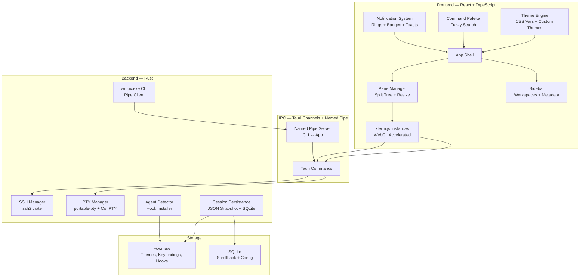

# wmux — cmux for Windows

A Windows-native terminal multiplexer inspired by [cmux](https://cmux.com) (macOS-only). Built for developers who run multiple terminals and AI coding agents side by side. **Tauri v2** (Rust) + **React** (TypeScript).

## cmux Feature Analysis → wmux Adaptation

After deep-diving cmux's website, docs, and GitHub, here's how we map their feature set to Windows:

| cmux Feature (macOS) | wmux Adaptation (Windows) |
|---|---|
| Built on **libghostty** (Swift/AppKit) | Built on **xterm.js + WebGL** in Tauri webview |
| **Notification rings** on panes when agents need attention | ✅ Same concept — glow border animation + Windows toast notifications |
| **Vertical tabs** sidebar with git branch, CWD, ports | ✅ Same — sidebar shows workspace metadata |
| **In-app browser** pane (scriptable) | ✅ WebView2 pane (Windows ships WebView2 natively) |
| **CLI + Unix socket** API for programmability | **CLI + Named pipe** API (`\\.\pipe\wmux`) |
| **Agent session resume** (Claude Code, Codex, Gemini, etc.) | ✅ Same hooks system — detect agent session IDs, re-run `--resume` commands |
| **Session restore** (layout, scrollback, CWD, browser state) | ✅ Same — JSON snapshot + SQLite for scrollback |
| **Split panes** (horizontal + vertical) | ✅ Same |
| **SSH & remote tmux** attach | ✅ SSH via `ssh2` crate |
| **Workspace groups** (multiple windows with linked workspaces) | ✅ Adapted for Windows multi-window |
| **Two-step keyboard chords** (tmux-style prefix bindings) | ✅ Same system, configurable via JSON |
| **GPU-accelerated** rendering via Metal | **GPU-accelerated** via xterm.js WebGL addon |
| macOS Dock integration + iOS companion | Windows **system tray** + (future) mobile web companion |

---

## Resolved Decisions

- ✅ **App name**: `wmux` confirmed
- ✅ **Scope**: v1 includes core terminal + pane splits + session persistence + notification rings + CLI API + agent resume + **in-app browser**. Workspace groups deferred to v2.
- ✅ **Default shell**: Auto-detect (PowerShell 7 > PowerShell 5 > cmd), user can override in Settings
- ✅ **Agent detection**: Auto-detect installed agents on first launch + manual enable/disable in Settings
- ✅ **IPC**: Named pipes (`\\.\pipe\wmux`) — the native Windows mechanism

---

## Architecture Overview



---

## Proposed Changes

### Phase 1: Project Scaffolding & Core Setup

#### [NEW] Project initialization

```bash
npm create tauri-app@latest ./  # React + TypeScript
```

**Directory structure:**
```
wmux/
├── src/                            # React frontend
│   ├── components/
│   │   ├── layout/
│   │   │   ├── AppShell.tsx         # Main layout: sidebar + content
│   │   │   ├── Sidebar.tsx          # Vertical workspace tabs
│   │   │   ├── StatusBar.tsx        # Bottom: shell, CWD, git branch
│   │   │   └── TitleBar.tsx         # Custom window titlebar
│   │   ├── terminal/
│   │   │   ├── TerminalPane.tsx     # Single xterm.js instance
│   │   │   ├── PaneContainer.tsx    # Recursive split tree
│   │   │   ├── PaneDivider.tsx      # Draggable resize handle
│   │   │   └── NotificationRing.tsx # Glowing border when agent needs attention
│   │   ├── workspace/
│   │   │   ├── WorkspaceTab.tsx     # Sidebar entry (name, git, CWD, ports, badge)
│   │   │   └── WorkspaceManager.tsx # Create/rename/delete workspaces
│   │   ├── ssh/
│   │   │   ├── SSHDialog.tsx        # Connection form
│   │   │   └── SavedConnections.tsx # Reusable connections
│   │   ├── settings/
│   │   │   ├── SettingsDialog.tsx    # Settings modal
│   │   │   ├── ThemeEditor.tsx      # Live theme preview
│   │   │   └── KeybindingEditor.tsx # Rebind shortcuts
│   │   └── shared/
│   │       ├── CommandPalette.tsx    # Ctrl+Shift+P
│   │       └── ContextMenu.tsx      # Right-click menus
│   ├── hooks/
│   │   ├── useTerminal.ts           # Terminal lifecycle
│   │   ├── useWorkspace.ts          # Workspace CRUD
│   │   ├── usePaneLayout.ts         # Split tree state
│   │   ├── useKeybindings.ts        # Shortcut dispatch
│   │   ├── useTheme.ts              # Theme loading
│   │   └── useNotifications.ts      # OSC 9/99/777 detection
│   ├── stores/
│   │   ├── workspaceStore.ts        # Zustand: workspace state
│   │   ├── terminalStore.ts         # Zustand: terminals
│   │   └── settingsStore.ts         # Zustand: user prefs
│   ├── lib/
│   │   ├── tauri-bridge.ts          # Typed invoke() wrappers
│   │   ├── keybindings.ts           # Default keymap
│   │   └── notifications.ts         # OSC escape sequence parser
│   ├── types/
│   │   └── index.ts                 # Shared types
│   └── themes/
│       ├── midnight.ts              # Default dark
│       ├── daylight.ts              # Default light
│       └── types.ts                 # Theme interface
├── src-tauri/                       # Rust backend
│   ├── src/
│   │   ├── main.rs
│   │   ├── lib.rs
│   │   ├── pty/
│   │   │   ├── mod.rs
│   │   │   ├── manager.rs           # PTY spawn, I/O, resize, kill
│   │   │   └── shell.rs             # Shell detection (pwsh > powershell > cmd)
│   │   ├── ssh/
│   │   │   ├── mod.rs
│   │   │   ├── session.rs           # SSH client via ssh2
│   │   │   └── auth.rs              # Key/password/agent auth
│   │   ├── persistence/
│   │   │   ├── mod.rs
│   │   │   ├── snapshot.rs          # JSON session snapshot (cmux-style)
│   │   │   ├── scrollback.rs        # SQLite scrollback storage
│   │   │   └── agent_hooks.rs       # Agent session ID tracking
│   │   ├── ipc/
│   │   │   ├── mod.rs
│   │   │   └── named_pipe.rs        # Named pipe server for CLI
│   │   ├── notifications/
│   │   │   ├── mod.rs
│   │   │   └── osc_parser.rs        # Parse OSC 9/99/777 from PTY output
│   │   ├── config/
│   │   │   ├── mod.rs
│   │   │   └── settings.rs
│   │   └── commands/
│   │       ├── mod.rs
│   │       ├── terminal.rs
│   │       ├── workspace.rs
│   │       ├── ssh.rs
│   │       └── settings.rs
│   └── Cargo.toml
├── cli/                             # Standalone wmux.exe CLI
│   ├── src/
│   │   └── main.rs                  # Named pipe client
│   └── Cargo.toml
├── package.json
└── README.md
```

---

### Phase 2: PTY Manager + Terminal Rendering

#### [NEW] `src-tauri/src/pty/manager.rs`
- Spawn PTY via `portable-pty` using ConPTY on Windows
- Dedicated reader/writer threads per PTY
- Stream output to frontend via Tauri Channels (binary, batched at 16ms)
- Ring buffer captures last N lines for persistence (default: 10,000)
- Parse OSC escape sequences inline to detect notification triggers

#### [NEW] `src/components/terminal/TerminalPane.tsx`
- xterm.js with `addon-webgl` (GPU), `addon-fit`, `addon-serialize`, `addon-search`, `addon-web-links`
- Bidirectional data streaming via Tauri Channel

**Rust dependencies:**
```toml
portable-pty = "0.8"
ssh2 = "0.9"
rusqlite = { version = "0.31", features = ["bundled"] }
serde = { version = "1", features = ["derive"] }
serde_json = "1"
uuid = { version = "1", features = ["v4"] }
tokio = { version = "1", features = ["full"] }
parking_lot = "0.12"
dirs = "5"
flate2 = "1"
```

**NPM dependencies:**
```json
{
  "@xterm/xterm": "^5.5",
  "@xterm/addon-fit": "^0.10",
  "@xterm/addon-webgl": "^0.18",
  "@xterm/addon-serialize": "^0.13",
  "@xterm/addon-search": "^0.15",
  "@xterm/addon-web-links": "^0.11",
  "zustand": "^5",
  "react-resizable-panels": "^2",
  "cmdk": "^1",
  "lucide-react": "^0.400"
}
```

---

### Phase 3: Pane Splitting & Workspace Management

#### [NEW] `src/components/terminal/PaneContainer.tsx`
Recursive binary split tree (like cmux's split system):

```typescript
type PaneNode =
  | { type: 'terminal'; id: string; terminalId: string }
  | { type: 'split'; direction: 'horizontal' | 'vertical'; 
      ratio: number; children: [PaneNode, PaneNode] };
```

- Drag-to-resize dividers
- Keyboard navigation between panes
- Zoom/unzoom pane (maximize a single pane, restore with same shortcut)

#### [NEW] `src/components/layout/Sidebar.tsx`
Vertical sidebar (inspired by cmux) showing:
- Workspace name (editable)
- Git branch (detected from CWD)
- Working directory
- Active ports (detected from process)
- Notification badge count
- Drag to reorder workspaces

---

### Phase 4: Notification System (cmux's Killer Feature)

#### [NEW] `src-tauri/src/notifications/osc_parser.rs`
Parse terminal escape sequences from PTY output:
- **OSC 9**: Desktop notification (`\e]9;message\e\\`)
- **OSC 99**: Progress notification
- **OSC 777**: Rich notification with title

#### [NEW] `src/components/terminal/NotificationRing.tsx`
Visual notification system:
- **Pane glow**: Animated border (cyan/amber) when a pane has unread notifications
- **Sidebar badge**: Unread count on workspace tabs
- **Windows toast**: Native Windows notification via Tauri
- **Notification panel**: Popover showing all recent notifications

This is what makes cmux special — when an AI agent needs attention (e.g., permission request), the pane lights up. We bring this to Windows.

---

### Phase 5: Session Persistence & Agent Resume

#### [NEW] `src-tauri/src/persistence/snapshot.rs`
cmux-style JSON snapshot (adapted for Windows):

```json
{
  "version": 1,
  "windows": [{
    "position": [100, 100],
    "size": [1920, 1080],
    "workspaces": [{
      "id": "ws-1",
      "name": "myproject",
      "cwd": "C:\\projects\\myproject",
      "paneLayout": { "type": "split", "direction": "vertical", "ratio": 0.5, "children": [...] },
      "panes": [{
        "id": "pane-1",
        "type": "local",
        "shell": "pwsh.exe",
        "cwd": "C:\\projects\\myproject",
        "scrollPosition": 1234,
        "agentResume": {
          "agent": "claude",
          "sessionId": "sess_abc123",
          "command": "claude --resume sess_abc123"
        }
      }]
    }]
  }],
  "savedAt": "2026-09-11T00:30:00Z"
}
```

**Restore flow:**
1. On launch → read `~/.wmux/session.json`
2. Recreate windows, workspaces, pane layouts
3. For each pane: spawn PTY, `cd` to saved CWD
4. Write saved scrollback to xterm.js (from SQLite, compressed)
5. If `agentResume` exists and auto-resume enabled → run resume command

#### [NEW] `src-tauri/src/persistence/agent_hooks.rs`
Agent detection & hook installation (cmux's `cmux hooks setup` equivalent):

| Agent | Binary | Resume Command | Hook Location |
|---|---|---|---|
| Claude Code | `claude.exe` | `claude --resume <id>` | `%APPDATA%\claude\hooks\` |
| Codex | `codex.exe` | `codex resume <id>` | `%APPDATA%\codex\hooks\` |
| Gemini CLI | `gemini.exe` | `gemini --resume <id>` | `%APPDATA%\gemini\hooks\` |
| Antigravity | `agy.exe` | `agy --conversation <id>` | `%APPDATA%\agy\hooks\` |
| OpenCode | `opencode.exe` | `opencode --session <id>` | Plugin event bus |

---

### Phase 6: CLI & Named Pipe API

#### [NEW] `cli/src/main.rs` + `src-tauri/src/ipc/named_pipe.rs`

Standalone `wmux.exe` CLI that communicates with the running app via Windows named pipe (`\\.\pipe\wmux`):

```bash
# Workspace commands
wmux list-workspaces
wmux new-workspace
wmux select-workspace --workspace <id>

# Split commands  
wmux new-split right
wmux new-split down --command "npm run dev"

# Surface commands
wmux send-text "hello world"
wmux read-screen --surface <id>

# Agent hooks
wmux hooks setup
wmux hooks setup claude

# Session
wmux restore-session

# All commands support --json for machine-readable output
wmux list-workspaces --json
```

Protocol: JSON-RPC style over named pipe (same as cmux's Unix socket protocol):
```json
{"id": "req-1", "method": "workspace.list", "params": {}}
→ {"id": "req-1", "ok": true, "result": {"workspaces": [...]}}
```

---

### Phase 7: Keybinding System

Default shortcuts (Windows-adapted from cmux's macOS shortcuts):

| Action | Shortcut | cmux Equivalent |
|---|---|---|
| Command palette | `Ctrl+Shift+P` | `⌘+⇧+P` |
| New workspace | `Ctrl+N` | `⌘+N` |
| Go to workspace (switcher) | `Ctrl+P` | `⌘+P` |
| Toggle sidebar | `Ctrl+B` | `⌘+B` |
| New surface (tab) | `Ctrl+T` | `⌘+T` |
| Close surface | `Ctrl+W` | `⌘+W` |
| Split right | `Ctrl+Shift+D` | `⌘+D` |
| Split down | `Ctrl+Shift+E` | `⌘+⇧+D` |
| Navigate panes | `Ctrl+Shift+Arrow` | `⌘+⌥+Arrow` |
| Next workspace | `Ctrl+Shift+]` | `⌃+⌘+]` |
| Prev workspace | `Ctrl+Shift+[` | `⌃+⌘+[` |
| Zoom pane | `Ctrl+Shift+Z` | `⌘+⇧+Enter` |
| Find in terminal | `Ctrl+Shift+F` | `⌘+F` |
| Show notifications | `Ctrl+Shift+I` | `⌘+⇧+I` |
| Reopen previous session | `Ctrl+Shift+O` | `⌘+⇧+O` |
| Settings | `Ctrl+,` | `⌘+,` |

**Two-step chords** supported (tmux-style), configurable in `~/.wmux/wmux.json`:
```json
{
  "shortcuts": {
    "bindings": {
      "newSurface": ["ctrl+b", "c"],
      "splitRight": ["ctrl+b", "%"],
      "splitDown": ["ctrl+b", "\""]
    }
  }
}
```

---

### Phase 8: Theme Engine & Premium UI

#### Theme system
- CSS custom properties for all colors
- xterm.js theme integration (terminal + UI chrome unified)
- Built-in: **Midnight** (dark), **Daylight** (light), **Nord**, **Dracula**
- Custom themes via `~/.wmux/themes/*.json`
- Live preview in settings

#### Windows-native polish
- **Mica/Acrylic** backdrop (Windows 11) via Tauri window effects
- Custom titlebar with Windows-native minimize/maximize/close buttons
- **System tray** icon with quick actions
- Smooth animations: pane splits, sidebar expand/collapse, notification rings
- **Active pane indicator**: subtle glow on focused terminal
- JetBrains Mono / Cascadia Code font defaults

---

## Development Phases & Timeline

| Phase | Description | Effort |
|---|---|---|
| 1 | Project scaffold (Tauri + React + TypeScript) | ~1 day |
| 2 | PTY manager + xterm.js terminal rendering | ~2 days |
| 3 | Pane splitting + workspace management + sidebar | ~3 days |
| 4 | Notification system (OSC parsing + rings + toasts) | ~2 days |
| 5 | Session persistence + agent resume hooks | ~2 days |
| 6 | CLI + named pipe API | ~1 day |
| 7 | Keybinding system + command palette | ~1 day |
| 8 | In-app browser pane (WebView2) | ~2 days |
| 9 | Theme engine + Windows polish (Mica, tray, animations) | ~2 days |

**Total: ~16 days**

---

## Verification Plan

### Automated Tests
```bash
cd src-tauri && cargo test     # PTY, persistence, OSC parsing, named pipe
npm run test                    # React components, stores, keybindings
```

### Manual Verification
- Create 5+ workspaces with splits → close app → reopen → verify all restore
- Run `claude code` in a pane → trigger permission request → verify notification ring glows
- Use `wmux.exe` CLI to create splits, send text, list workspaces
- Connect via SSH → run commands → verify streaming works
- Change theme → verify terminal + UI update in real-time
- Stress test: 15+ panes with concurrent dev servers
- Test persistence after full Windows restart
- Verify Mica/Acrylic effect on Windows 11
